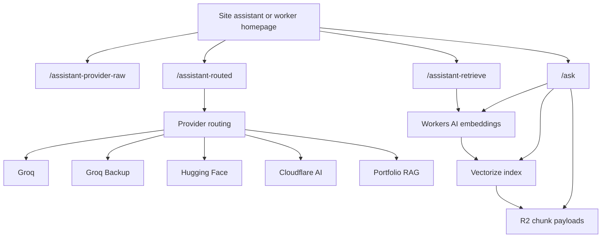

# Cloudflare Worker

This worker is the shared runtime for:

- GitHub OAuth for Decap CMS
- contact form delivery
- assistant raw and routed model calls
- Cloudflare semantic retrieval over the portfolio dataset
- the lightweight assistant debugger home page at `/`
- the grounded portfolio RAG API at `/ask`

## Files

- `src/index.ts`: unified Worker implementation
- `wrangler.jsonc`: Worker config
- `.dev.vars.example`: local development secret template
- `src/rag/*`: isolated RAG runtime helpers
- `src/utils/providers.ts`: raw provider + routed fallback logic
- `scripts/ingest.ts`: dataset ingestion script for Vectorize + R2
- `scripts/build-rag-dataset.ts`: builds a single RAG dataset from the existing portfolio content

## Assistant architecture



### Important assistant routes

- `/assistant`
  Workers AI embeddings endpoint used by the site when embeddings are needed.
- `/assistant-provider-raw`
  Raw per-provider debug route used by the site debug panel and worker homepage.
- `/assistant-routed`
  Structured routed chat endpoint with fallback between configured providers.
- `/assistant-retrieve`
  Semantic retrieval endpoint that returns Vectorize/R2-backed snippet chunks.
- `/ask`
  Grounded portfolio RAG answer route.
- `/`
  Small same-origin debugger UI for trying all of the above quickly.

## GitHub OAuth app

Create a GitHub OAuth app with:

- Homepage URL: `https://hassanraza.us`
- Authorization callback URL: `https://personal-portfolio.hassanraza632.workers.dev/callback`

## Cloudflare secrets

Set these secrets before deploy:

```bash
cd cloudflare-worker
npm install
npx wrangler secret put GITHUB_CLIENT_ID
npx wrangler secret put GITHUB_CLIENT_SECRET
```

## Deploy

```bash
cd cloudflare-worker
npm install
npx wrangler deploy
```

## Expected Worker URL

This repo's Decap config currently points to:

`https://personal-portfolio.hassanraza632.workers.dev/`

If your deployed Worker URL changes, update [config.yml](/Users/hassanraza/Projects/Personal-Portfolio/public/cms-admin/config.yml) and your GitHub OAuth callback URL together.

## Expected local and production admin URLs

- Production: `https://hassanraza.us/cms-admin/`
- Local: `http://localhost:3000/cms-admin/`

## How authorization is restricted

The Worker fetches the authenticated GitHub profile and only completes login when:

- `profile.login === "autodidactGuy"`

Anyone else receives `403 Access denied`.

## Local development

For fast offline/local-only testing you can still use `.dev.vars`, but for full assistant testing it is better to run the worker locally against remote Cloudflare bindings and secrets.

### Local worker with remote Cloudflare credentials

When Wrangler serves the worker on a local URL like `http://127.0.0.1:8787`, the worker automatically accepts localhost origins from the local site while still using the default remote Worker secrets and bindings.

Run it with:

```bash
cd cloudflare-worker
yarn install
yarn dev:remote
```

This starts `wrangler dev --remote`, so requests from your local Next app can hit the worker while still using your configured remote Cloudflare secrets.

### Pure local worker mode

If you want a fully local worker instead:

1. Copy `.dev.vars.example` to `.dev.vars`
2. Fill in your secrets
3. Run:

```bash
cd cloudflare-worker
yarn install
yarn dev
```

## RAG Artifacts

The RAG functionality now ships inside the same worker, but it stays isolated behind the `/` and `/ask` routes plus the portfolio-rag provider fallback used by `/assistant-routed`.

### Exact file structure

- `src/index.ts`
- `src/rag-app.ts`
- `src/rag/config.ts`
- `src/rag/prompt.ts`
- `src/rag/retrieve.ts`
- `src/rag/response.ts`
- `src/rag/types.ts`
- `scripts/ingest.ts`
- `scripts/lib/dataset.ts`
- `scripts/lib/chunking.ts`
- `scripts/lib/ids.ts`
- `scripts/lib/cloudflare-api.ts`

### Setup steps

1. Create a Vectorize index with the dimensions that match your configured embedding model and cosine distance:

```bash
cd cloudflare-worker
yarn rag:index:create
```

2. Create an R2 bucket for chunk payloads:

```bash
cd cloudflare-worker
npx wrangler r2 bucket create YOUR_R2_BUCKET_NAME
npx wrangler r2 bucket create YOUR_R2_PREVIEW_BUCKET_NAME
```

3. Copy the bucket names into `wrangler.jsonc`.
4. Generate worker env types once bindings are finalized:

```bash
cd cloudflare-worker
yarn rag:types
```

5. Provide Cloudflare credentials plus a dataset file path, then run ingestion:

```bash
cd cloudflare-worker
export CLOUDFLARE_ACCOUNT_ID=...
export CLOUDFLARE_API_TOKEN=...
export CLOUDFLARE_VECTORIZE_INDEX=portfolio-rag-index-v2
export CLOUDFLARE_R2_BUCKET=YOUR_R2_BUCKET_NAME
export CLOUDFLARE_R2_ACCESS_KEY_ID=...
export CLOUDFLARE_R2_SECRET_ACCESS_KEY=...
yarn rag:ingest ./data/portfolio-rag.json
```

6. Test the unified worker locally against remote bindings:

```bash
cd cloudflare-worker
yarn rag:dev:remote
```

### Automated build and deploy flow

The RAG flow can now build its own dataset from the existing portfolio content, ingest it into Vectorize + R2, and then deploy the worker.

```bash
cd cloudflare-worker
export CLOUDFLARE_ACCOUNT_ID=...
export CLOUDFLARE_API_TOKEN=...
export CLOUDFLARE_VECTORIZE_INDEX=portfolio-rag-index-v2
export CLOUDFLARE_R2_BUCKET=YOUR_R2_BUCKET_NAME
export CLOUDFLARE_R2_ACCESS_KEY_ID=...
export CLOUDFLARE_R2_SECRET_ACCESS_KEY=...
yarn rag:build
```

That command does three things:

1. runs the root `resume:generate` step so the latest portfolio data is available
2. builds `.generated/portfolio-rag.json` from the current portfolio content
3. embeds and upserts the chunks into Vectorize and stores chunk payloads in R2

To ingest and deploy in one command:

```bash
cd cloudflare-worker
export CLOUDFLARE_ACCOUNT_ID=...
export CLOUDFLARE_API_TOKEN=...
export CLOUDFLARE_VECTORIZE_INDEX=portfolio-rag-index-v2
export CLOUDFLARE_R2_BUCKET=YOUR_R2_BUCKET_NAME
export CLOUDFLARE_R2_ACCESS_KEY_ID=...
export CLOUDFLARE_R2_SECRET_ACCESS_KEY=...
yarn rag:deploy
```

If you use Cloudflare Workers Builds, set the deploy command to `yarn rag:deploy` so ingestion happens automatically before the worker deploy step.

### GitHub setup for the deploy workflow

Add these repository secrets in GitHub:

1. Open the repository on GitHub.
2. Go to `Settings` -> `Secrets and variables` -> `Actions`.
3. Add these secrets:

- `CLOUDFLARE_ACCOUNT_ID`
- `CLOUDFLARE_API_TOKEN`
- `CLOUDFLARE_VECTORIZE_INDEX`
- `CLOUDFLARE_R2_BUCKET`
- `CLOUDFLARE_R2_ACCESS_KEY_ID`
- `CLOUDFLARE_R2_SECRET_ACCESS_KEY`

Notes:

- `CLOUDFLARE_VECTORIZE_INDEX` should usually be `portfolio-rag-index-v2`.
- The deploy workflow is [deploy-worker.yml](/Users/hassanraza/Projects/Personal-Portfolio/.github/workflows/deploy-worker.yml).
- That workflow installs the root app and worker dependencies, rebuilds the resume dataset, ingests vectors and chunk objects, and then deploys the unified worker when triggered manually.

### Provider configuration

Important vars in `wrangler.jsonc`:

- `ASSISTANT_PROVIDER_PRIORITY`
  Comma-separated routed order such as `groq,groq_backup,huggingface,cloudflare,portfolio-rag,github-models`
- `GROQ_MODEL`
  Primary Groq model
- `GROQ_BACKUP_MODEL`
  Backup Groq model used by both raw debug and routed fallback
- `CLOUDFLARE_AI_MODEL`
  Workers AI fallback model
- `RAG_EMBED_MODEL`
  Workers AI embedding model for semantic retrieval
- `RAG_CHAT_MODEL`
  Workers AI generation model for the grounded `/ask` flow

### How ingestion works

The ingestion pipeline is:

1. `scripts/build-rag-dataset.ts`
   Reads the current portfolio content from this repo and emits one normalized JSON dataset at `cloudflare-worker/.generated/portfolio-rag.json`.
2. `scripts/ingest.ts`
   Loads that dataset, creates summary and body chunks, generates deterministic IDs, batches embeddings through Workers AI, upserts vectors into Vectorize, and stores full chunk payloads in R2 by object key.
3. `src/rag-app.ts`
   At runtime, `/ask` embeds the question, queries Vectorize, loads matching chunk payloads from R2 via vector metadata, and only calls the LLM when retrieval is strong enough.
4. `src/utils/providers.ts`
   `/assistant-routed` can also use the same Cloudflare semantic retrieval indirectly because the site first asks `/assistant-retrieve`, merges those chunks with keyword matches, and then sends the reduced snippet set through the routed endpoint.

The worker also serves a built-in provider console on `/` so you can:

- compare raw providers
- inspect Cloudflare semantic retrieval snippets
- simulate a frontend-style `/assistant-routed` call
- test grounded `/ask` behavior from the same worker origin

### Dataset expectations

The ingestion script expects one JSON file and supports flexible top-level aliases:

- `personal`, `basic`, or `profile`
- `experience`
- `education`
- `entries`, `posts`, or `portfolio`

Each content entry should include a `title` and may include `summary`, `excerpt`, `body`, `content`, `sections`, `tags`, `slug`, `url`, and `priority`.

The automated dataset builder already produces this shape from:

- `public/api/resume.json`
- `content/posts/*.mdx`

The builder now includes the full `resume.json` surface area, including:

- hero content
- about content
- featured focus
- home stats
- interests
- skills
- links
- contact details
- recommendations
- experience
- education
- projects
- articles
- case studies

When a matching post exists in `content/posts/*.mdx`, the builder prefers the full MDX body so the vector dataset has richer retrieval content than the short summary alone.

### Free-tier optimizations and tradeoffs

- Uses `@cf/baai/bge-small-en-v1.5` embeddings at 384 dimensions to keep Vectorize storage and query cost low.
- Uses KV for chunk payload lookup instead of D1 because the dataset is mostly static and lookup-after-search is simple.
- Keeps retrieval small with `topK=6` and `maxContextChunks=4`.
- Skips the LLM call entirely when retrieval is empty or below threshold.
- Uses batch embeddings, Vectorize upserts, and KV bulk writes during ingestion to reduce request overhead.
- Stores only small indexed metadata in Vectorize and full chunk payloads in KV.
