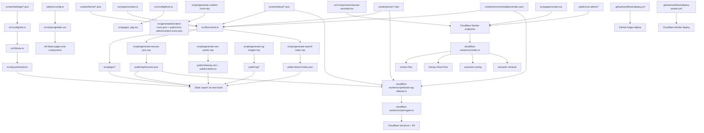

# Repo Architecture Graph

This file is the graph-style source of truth for how the repo fits together.

Update this file in the same change whenever nodes, edges, ownership, generated outputs, or deployment paths change.

## System Graph

## Node Notes

- `src/lib/content.ts` is the content orchestration hub for the site.
- `src/types/content.ts` is the schema boundary for content files.
- `src/styles/globals.css` owns color tokens and theme variables.
- `src/config/fonts.ts` owns font families.
- `src/lib/seo.ts` plus `src/layouts/head.tsx` own metadata and structured data behavior.
- `public/*` generated assets are downstream outputs and should not become manual truth sources.
- The worker depends on portfolio content and generated resume data for RAG ingestion and assistant quality.

## Update Rules

Update this graph when any of the following changes happen:

- A new content collection, generated artifact, or build script is added.
- A page starts reading from a different content or config source.
- A new worker endpoint, provider, or storage dependency is introduced.
- Deployment ownership moves between GitHub Pages, Cloudflare, or another platform.
- The design system source of truth moves away from the current token files.
- The app stops being static-first or gains a new server/runtime path.
